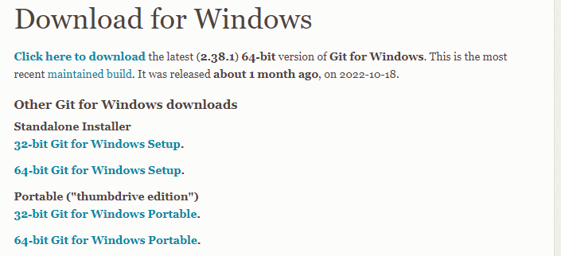
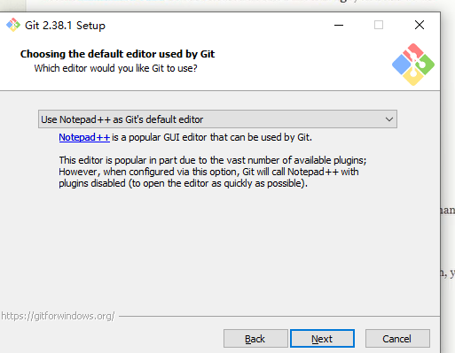
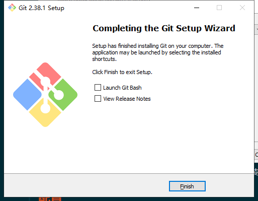
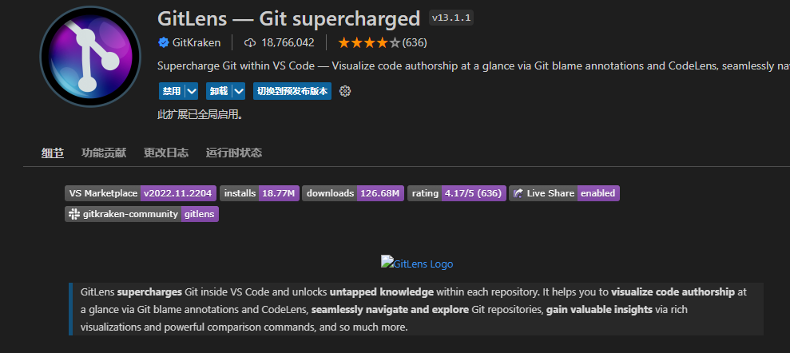

# 01.Git简介
git是一个免费开源的版本控制系统，它被设计用来快速高效地管理项目开发的源码。通过git可以跟踪代码的状态，也可以在修改代码后对代码状态进行存储，还可以在需要时将已经修改过的代码恢复到之前存储的状态。更强大的是使用git管理代码时，可以创建代码分支（branch），代码分支相当于一段独立的代码记录，我们可以在分支上对代码进行任意的修改，而这个修改只会影响当前分支，不会对其他分支产生影响。同时，可以对分支进行合并，合并后一个分支的修改便可在另一分支上生效。总之，git是当今最优秀的版本控制工具！
## 安装
下载地址：https://git-scm.com/download/win

选择编辑器

完成

打开命令行，输入git -v，能看到正常输出版本信息即表示安装成功。

## 配置
* 使用git前，我们需要配置一下两个属性name和email，这两个信息会用来在存储代码时记录用户的身份。可以直接在命令行中通过指令来设置：
`git config --global user.name "xxx"`
`git config --global user.email "xxx"`
* 初始化项目：
`D:\Git-GitHub\git-demo>git init`
默认情况下，磁盘中的文件并不由git管理，我们必须要对代码目录进行初始化，初始化后git才能正常的管理文件。进入目录后，直接在目录中执行git init即可完成项目的初始化，初始化后目录中会多出一个.git目录，这个目录用来存储代码的版本信息，有了.git就意味着项目现在已经开始被.git管理了，不希望项目被git管理时，只需删除项目中的.git即可。
## 文件状态
git中的文件有两种状态：未跟踪和已跟踪。未跟踪指文件没有被git所管理，已跟踪指文件已被git管理。
已跟踪的文件又有三种状态：未修改、修改和暂存。

* 暂存，表示文件修改已经保存，但是尚未提交到git仓库。
* 未修改，表示磁盘中的文件和git仓库中文件相同，没有修改。
* 已修改，表示磁盘中文件已被修改，和git仓库中文件不同。

可以通过git status来查看文件的状态

## 基本操作
* 未跟踪 —> 暂存（已跟踪）
使用git add <file>命令来将文件修改为已跟踪状态
`git add .\1.txt`
add命令是一个多功能的命令，如果对未跟踪的文件调用它会将其设置为已跟踪，并将其转换为暂存状态。如果对已跟踪的文件调用，它就仅仅会将文件设置为暂存状态。
`git add * ` 可以将所有未跟踪文件改为已跟踪的暂存状态
* 暂存 —> 未修改
使用`git commit -m "信息"`，来将暂存的文件提交到git仓库，此时所有暂存文件都变成了未修改的状态。
使用编辑器对修改状态的文件进行修改，即可使其变为已修改的状态。
信息，是对每次存储到仓库的文件的说明信息，相当于日志信息
`git commt -a -m “信息”`提交所有已修改文件到未修改状态
* 已修改 —> 暂存
同样调用add指令，将已修改文件变为暂存状态。

`git log` 查看存储日志信息
## 常作命令
* 重置文件 
`git restore <filename>`
`git restore --staged <filename>` ：取消暂存
* 删除文件 
`git re <filename>`
`git re <filename> -f`：强制删除
* 移动文件
`git mv from to `:移动文件 ，或重命名

## 安装git插件
GitLens git的辅助工具，进行视图化显示和管理代码

## 分支
git在存储文件 时， 每一次提交代码都会创建一个与之对应的节点，git就是通过一个一个的节点来记录代码的状态的。节点会构成一个树状结构，树状结构就意味着这个树会分支，默认情况下仓库只有一个分支，自动命名为master。在使用git时，可以创建多个分支，分支与分支之间相互独立，在一个分支上个修改代不会影响其它分支。
```
git branch    //查看分支
git branch <branch name>    //创建新分支
git branch -d <branch name>    //删除分支
git switch <branch name>    //切换分支
git switch -c <branch name>    //创建并切换分支
```
在开发中，都是在各自的分支上编定代码，代码编写完成后，再回到主分支，将其它分支根据需要合并到主分支
```
git switch master    //切换到主分支
git merge <branch name>    //将<branch name>合并到主分支（当前分支）
```
当自动合并提示失败时，需手动检查调整，选择